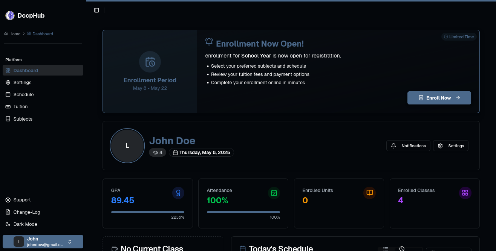

## DCCPHub – School Portal (Faculty & Students)

This is a modern School Portal for DCCP, built for both Faculty and Students. It provides dashboards, attendance, schedules, enrollment, notifications, and a mobile-ready PWA/Android app experience.



### Key Features

- **Student Portal**: Dashboard, enrollment status, attendance statistics/history, class schedule, tuition and subjects.
- **Faculty Portal**: Dashboard, classes, students, schedules, attendance setup/marking/bulk update/reset, reports and analytics, grades import/export (scaffolded).
- **Authentication**: Fortify-based login with custom dual authentication, Google OAuth (web and Capacitor mobile), magic link login, Jetstream teams, Sanctum SPA sessions.
- **PWA + Mobile**: Installable PWA with offline support and Workbox service worker; Android APK via Capacitor with deep-link OAuth.
- **Realtime & Notifications**: Pusher for realtime events, Web Push notifications, in-app toasts.
- **Admin**: FilamentPHP admin panel at `/admin`.

### Tech Stack

- **Backend**: Laravel 11, Octane (FrankenPHP), Fortify, Jetstream, Socialite, Sanctum, Horizon-ready
- **Frontend**: Inertia.js, Vue 3, Vite, Tailwind CSS (with `@tailwindcss/forms` and `typography`), Unhead/Capo, Ziggy
- **Build/Tooling**: Node/Vite or Bun, ESLint + Pint, Pest tests
- **Mobile/PWA**: Capacitor (Android), Workbox, LaravelPWA

---

## Getting Started (Local)

### Prerequisites

- PHP 8.3+
- Composer
- Node 18+ (or Bun 1.x)
- MySQL/MariaDB or SQLite

### Setup

```bash
# 1) Install PHP dependencies
composer install

# 2) Configure environment
cp .env.example .env  # if you don’t have one, see the sample below
php artisan key:generate

# 3) Configure database in .env, then run migrations (and optional seed)
php artisan migrate --force
# php artisan db:seed   # optional if you add seeders

# 4) Install JS deps (pick one)
npm install
# or
bun install

# 5) Start dev servers (two terminals)
php artisan serve
npm run dev   # or: bun run dev

# Optional: run a queue worker if using notifications/async
php artisan queue:listen
```

Access the app at `http://localhost:8000`.

### Sample .env (minimal)

```env
APP_NAME=DCCPHub
APP_ENV=local
APP_KEY=
APP_DEBUG=true
APP_URL=http://localhost:8000

LOG_CHANNEL=stack

DB_CONNECTION=mysql
DB_HOST=127.0.0.1
DB_PORT=3306
DB_DATABASE=dccphub
DB_USERNAME=root
DB_PASSWORD=

BROADCAST_DRIVER=pusher
CACHE_DRIVER=file
QUEUE_CONNECTION=database
SESSION_DRIVER=file
SESSION_LIFETIME=120

SANCTUM_STATEFUL_DOMAINS=localhost,127.0.0.1:8000
SESSION_DOMAIN=localhost

# Realtime (Pusher)
PUSHER_APP_ID=
PUSHER_APP_KEY=
PUSHER_APP_SECRET=
PUSHER_HOST=
PUSHER_PORT=443
PUSHER_SCHEME=https
PUSHER_APP_CLUSTER=mt1

# OAuth (Google)
GOOGLE_CLIENT_ID=
GOOGLE_CLIENT_SECRET=
GOOGLE_REDIRECT_URI="${APP_URL}/auth/callback/google"

# Optional
SENTRY_LARAVEL_DSN=
```

---

## Docker (Dev/Prod)

This repo includes a Docker setup with Octane/FrankenPHP.

```bash
# Build and start
docker compose up -d --build

# Customize ports via env (defaults)
# APP_PORT=80
# VITE_PORT=5173
```

See `docker-compose.yml` and `Dockerfile` for details.

---

## Build & Deploy

### Frontend

```bash
# Production build
npm run build  # or: bun run build

# Generate service worker if you use Workbox config
npm run generate-sw
```

### Cache Optimization

```bash
php artisan optimize
php artisan config:cache
php artisan route:cache
php artisan view:cache
```

### Queues & Horizon

Use a queue worker for notifications and background jobs:

```bash
php artisan queue:work
```

Horizon can be enabled/configured if desired.

---

## Android APK (Capacitor)

Android project lives under `android/`. There are helper scripts to prepare and build APKs.

```bash
# Prepare assets and Android project
npm run prepare:apk

# Build a signed release APK (configure keystore per scripts/docs)
npm run build:apk

# Build a debug APK
npm run build:debug-apk

# Open Android Studio (after copying web assets)
npm run cap:build
```

Mobile OAuth deep linking is supported; see `resources/js/utils/capacitor-social-login.js` and auth routes under `/auth`.

---

## App Structure & Notable Paths

- **Routes**: `routes/web.php`, `routes/api.php`
- **Views (Inertia shell)**: `resources/views/app.blade.php`
- **Frontend entry**: `resources/js/app.js`
- **Pages**:
  - Students: `resources/js/Pages/Student/*`
  - Faculty: `resources/js/Pages/Faculty/*`
  - Shared: `resources/js/Pages/*`, `resources/js/Layouts/*`
- **Faculty layout**: `resources/js/Layouts/FacultyLayout.vue`
- **Auth**: Fortify provider (`app/Providers/FortifyServiceProvider.php`), custom dual auth action, OAuth and magic link routes under `/auth`
- **Admin**: Filament panel provider (`app/Providers/Filament/AdminPanelProvider.php`) available at `/admin`
- **Build**: `vite.config.js`, `tailwind.config.js`

---

## Common URLs

- Student Dashboard: `/dashboard`
- Faculty Dashboard: `/faculty/dashboard`
- Enrollment: `/enroll`
- Attendance (faculty): `/faculty/attendance`
- APK page: `/apk`
- Admin Panel: `/admin`
- Offline page: `/offline`

---

## Screenshots


---

## Scripts

JS:

```bash
npm run dev
npm run build
npm run generate-sw
npm run prepare:apk
npm run build:apk
npm run build:debug-apk
npm run cap:build
npm run cap:sync
```

PHP (selected):

```bash
composer test         # Pest tests
composer analyse      # PHPStan
composer format       # Pint + Rector
```

---

## Testing & Linting

```bash
# PHP tests
composer test

# Lint Vue/JS
npm run lint
```

---

## Security

If you discover a security issue, please open a private issue or contact the maintainer directly.

---

## License

This project is open-sourced software licensed under the MIT license. See `LICENSE.md`.
